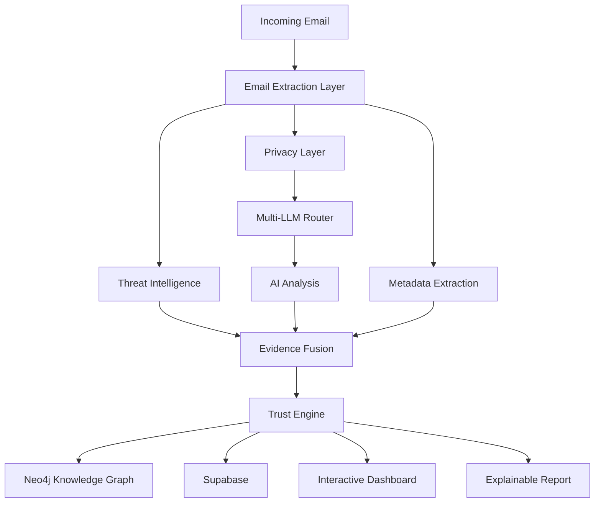

<div align="center">

# 🛡️ TrustGuardian AI

### Enterprise Trust Intelligence Platform

*"Shifting the paradigm from*
**'Is this email malicious?'**
*to*
**'Should the organization trust this request?'***

---


</div>

---

# 📌 Overview

TrustGuardian AI is an **Enterprise Trust Intelligence Platform** that protects organizations against **Business Email Compromise (BEC), CEO Fraud, Brand Impersonation, Social Engineering, and Workflow Manipulation**.

Unlike conventional phishing detectors that only classify whether an email is malicious, TrustGuardian evaluates **whether an organization should trust a business request**.

The platform combines deterministic security validation, explainable AI reasoning, enterprise relationship graphs, behavioral analysis, and historical trust modeling to deliver transparent and auditable security decisions.

---

# ✨ Key Features

- Enterprise Trust Scoring Engine
- Gmail API Integration
- Multi-LLM Intelligent Routing
- Automatic LLM Failover
- Privacy Layer (PII Redaction)
- SPF / DKIM / DMARC Validation
- VirusTotal URL Reputation
- Neo4j Knowledge Graph
- Explainable AI Reports
- Historical Trust Analysis
- Interactive Cyber Dashboard
- Confidence Score Generation
- Risk Categorization
- Threat Timeline
- Live Security Alerts

---

# 🏗 System Architecture



---

# 🔄 Complete Analysis Workflow

## 1. User Authentication

- Login using Google OAuth via Supabase.
- Secure authentication tokens are issued.
- Gmail account is connected securely.

---

## 2. Gmail Email Extraction

The backend connects to Gmail using the Gmail API and securely retrieves incoming emails.

Information extracted includes:

- Sender Information
- Email Headers
- Subject
- Email Body
- URLs
- Attachments
- Message Metadata

---

## 3. Threat Intelligence

The Threat Intelligence module performs deterministic verification.

### Email Authentication

- SPF Verification
- DKIM Verification
- DMARC Verification

### Reputation Checks

- VirusTotal URL Scan
- Domain Reputation
- Malicious Link Detection

---

## 4. Privacy Layer

Before any AI model receives the email:

Sensitive information is automatically removed.

Examples:

- Aadhaar Numbers
- PAN Numbers
- Bank Accounts
- Phone Numbers
- Email Addresses
- Employee IDs
- Customer Information

The LLM only receives a sanitized version.

No sensitive enterprise information leaves the organization.

---

## 5. Multi-LLM Intelligent Routing

TrustGuardian uses multiple AI providers.

Primary:

- Gemini 2.5 Flash

Fallback:

- Groq (Llama 3)

The router automatically switches providers when:

- Token limits are reached
- Rate limits occur
- Provider becomes unavailable

This guarantees uninterrupted AI analysis.

---

## 6. AI Behavioral Analysis

The AI analyzes psychological manipulation techniques.

Including:

- Urgency
- Authority
- Fear
- Familiarity
- Financial Requests
- Credential Requests
- Intent

---

## 7. Evidence Fusion Engine

Instead of trusting one AI response, TrustGuardian combines evidence from multiple sources.

Evidence includes:

- VirusTotal
- SPF
- DKIM
- DMARC
- AI Assessment
- Historical Trust
- Neo4j Relationships

The Trust Engine mathematically combines this evidence to generate explainable trust scores.

---

## 8. Trust Engine

The Trust Engine calculates:

- Trust Score
- Confidence Score
- Risk Level
- Recommended Action

Possible actions:

- Allow
- Verify
- Block

---

## 9. Neo4j Knowledge Graph

Historical organizational relationships are stored as a graph.

Examples:

Employee

↓

Department

↓

Manager

↓

Vendor

↓

Domain

↓

Past Communications

↓

Historical Trust

The graph enriches future decisions using historical behavior.

---

## 10. Explainable AI Report

Instead of saying

> "Risk Score = 82"

TrustGuardian explains

- Why
- Which evidence contributed
- Which AI indicators were detected
- Which authentication failed
- Recommended action
- Confidence level

---

# 🎨 Dashboard

The dashboard includes:

- Enterprise Trust Overview
- Live Email Analysis
- Trust Score Gauge
- Threat Timeline
- Knowledge Graph
- Risk Categories
- Confidence Meter
- Explainable Decision Panel
- Interactive Cyber Animations
- Real-Time Alerts

---

# 🧠 Core Modules

| Module | Purpose |
|---------|----------|
| Authentication | Google OAuth Login |
| Gmail Service | Email Retrieval |
| Extraction Layer | MIME Parsing |
| Threat Intelligence | SPF / DKIM / DMARC / VirusTotal |
| Privacy Layer | PII Redaction |
| Multi-LLM Router | Gemini → Groq Failover |
| AI Analyzer | Behavioral Analysis |
| Evidence Fusion | Evidence Aggregation |
| Trust Engine | Explainable Trust Score |
| Neo4j Service | Relationship Intelligence |
| Dashboard | Visualization |
| Report Generator | Explainable Reports |

---

# 📂 Project Structure

```
TrustGuardian-AI/

frontend/
│
├── src/
│   ├── api/
│   ├── components/
│   ├── pages/
│   ├── hooks/
│   ├── store/
│   ├── animations/
│   └── assets/

backend/
│
├── app/
│   ├── api/
│   ├── models/
│   ├── services/
│   ├── graph/
│   ├── llm/
│   ├── trust_engine/
│   └── main.py

README.md
```

---

# ⚙ Technology Stack

| Layer | Technology |
|--------|------------|
| Frontend | React 19 + TypeScript + Vite |
| UI | TailwindCSS |
| Animations | Framer Motion |
| 3D Graphics | Three.js |
| Graph Visualisation | Cytoscape.js |
| Backend | FastAPI |
| Database | Supabase PostgreSQL |
| Graph Database | Neo4j Aura |
| AI | Gemini 2.5 Flash |
| AI Fallback | Groq (Llama 3) |
| Threat Intelligence | VirusTotal API |
| Email Integration | Gmail API |

---

# 🚀 Installation

## Backend

```bash
cd backend

python -m venv .venv

source .venv/bin/activate

pip install -r requirements.txt

cp .env.example .env

uvicorn app.main:app --reload
```

---

## Frontend

```bash
cd frontend

npm install

cp .env.example .env

npm run dev
```

---

# 🔑 Environment Variables

Backend

```
GEMINI_API_KEY=

GROQ_API_KEY=

VIRUSTOTAL_API_KEY=

SUPABASE_URL=

SUPABASE_SERVICE_KEY=

NEO4J_URI=

NEO4J_USER=

NEO4J_PASSWORD=
```

Frontend

```
VITE_SUPABASE_URL=

VITE_SUPABASE_ANON_KEY=

VITE_GOOGLE_CLIENT_ID=
```

---

# 📊 Current Implementation Status

| Module | Status |
|----------|----------|
| Google OAuth | ✅ |
| Gmail API | ✅ |
| MIME Parser | ✅ |
| SPF/DKIM/DMARC | ✅ |
| VirusTotal Integration | ✅ |
| Privacy Layer | ✅ |
| Multi-LLM Router | ✅ |
| Automatic Failover | ✅ |
| Trust Engine | ✅ |
| Neo4j Integration | ✅ |
| Supabase Storage | ✅ |
| Interactive Dashboard | 🚧 |
| Decision Sandbox | 🚧 |
| Trust Replay | 🚧 |
| Analyst Copilot | 🚧 |

---

# 🔮 Future Roadmap

- Decision Sandbox™
- Trust Replay™
- Continuous Learning
- Analyst Copilot
- Threat Campaign Discovery
- Browser Extension
- Outlook Integration
- Microsoft Teams Integration
- Slack Integration

---

# 📜 License

This project is licensed under the **MIT License**.

---

<div align="center">

### TrustGuardian AI

**Enterprise Trust Intelligence Platform**

*"Trust is not predicted.*
*It is explained."*

</div>
