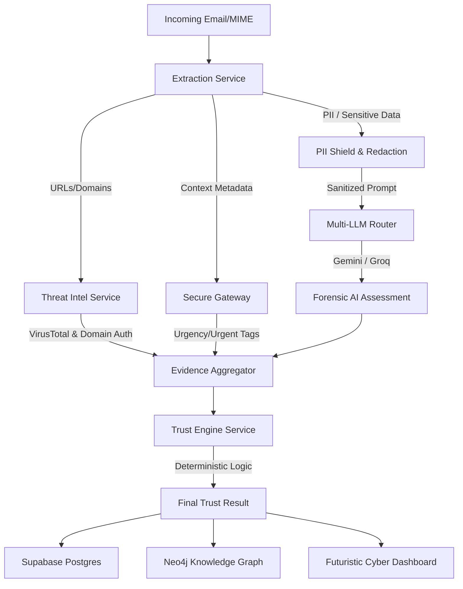

# 🛡️ TrustGuardian AI

### **Enterprise Trust Intelligence & Phishing Tracer Platform**

> *"Shift the paradigm from 'Is this email clean?' to 'Should our organization trust this request?'"*

TrustGuardian AI is a premium, developer-centric cybersecurity platform designed to protect enterprises against **Business Email Compromise (BEC)**, **CEO Fraud**, **Brand Impersonation**, and **financial workflow hijacking** in real time. By blending deterministic security scans, deep relationships on an Enterprise Knowledge Graph, and advanced cognitive AI, TrustGuardian acts as a self-healing defensive layer.

---

## 🗺️ Architectural Workflow



---

## 🚀 The End-to-End Analysis Lifecycle (User to Result)

Here is exactly how TrustGuardian AI intercepts, parses, evaluates, and displays threats:

### 1. Secure Authentication & Gmail Connection
* **User Onboarding:** The security analyst logs in via Supabase using **Google OAuth**.
* **Gmail Active Connection:** Once logged in, the frontend stores the user's `google-provider-token` locally. If this token expires (typically after 60 minutes), the frontend displays an interactive `🟢 Gmail Active` button, allowing the user to refresh their session credentials with a single click.

### 2. Live Email Fetching & Ingestion
* **Real-time Pull:** When the dashboard renders, it initiates a secure query to the backend API, passing the OAuth token.
* **MIME Parsing:** The backend [gmail_service.py](file:///c:/Users/shasheesh/OneDrive/Documents/final%20trust%20guardian%20AI/TrustGuardian-AI-1/backend/app/services/gmail_service.py) queries Google's Gmail API, pulls the most recent email thread, parses the MIME container, and splits it into header records (date, sender, subject) and the message body.
* **Text Truncation Guard:** To protect downstream LLMs from context length restrictions, the body snippet is securely truncated to 2,000 characters.

### 3. Verification & Threat Intelligence Scan
* **Domain Security Audit:** The [threat_intel_service.py](file:///c:/Users/shasheesh/OneDrive/Documents/final%20trust%20guardian%20AI/TrustGuardian-AI-1/backend/app/services/threat_intel_service.py) inspects the parsed email headers:
  * **SPF (Sender Policy Framework):** Verifies if the sending server is authorized by the domain's DNS.
  * **DKIM (DomainKeys Identified Mail):** Validates cryptographic signatures to prove the email was not tampered with.
  * **DMARC:** Verifies domain alignments.
  * If any verification fails, the backend adds flags like `"SPF failed"`.
* **VirusTotal API Link Inspection:** The service extracts all links (URLs) from the body text, encodes them, and queries the **VirusTotal v3 API**. If any security vendor flags the URL, a high-severity flag (e.g. `"1 URL(s) detected as malicious"`) is added. It uses an in-memory TTL cache to minimize API calls.

### 4. PII Redaction & AI Analysis
* **PII Redaction Guard:** Before transmitting data to the LLM, the [secure_gateway_service.py](file:///c:/Users/shasheesh/OneDrive/Documents/final%20trust%20guardian%20AI/TrustGuardian-AI-1/backend/app/services/secure_gateway_service.py) sanitizes sensitive identifiers (such as Aadhaar, PAN numbers, and bank details) to prevent leakage to external model providers.
* **Parallel Orchestration:** The backend triggers parallel checks.
* **AI Cognitive Scan:** The [llm_router.py](file:///c:/Users/shasheesh/OneDrive/Documents/final%20trust%20guardian%20AI/TrustGuardian-AI-1/backend/app/services/llm_router.py) routes the sanitized prompt to the primary AI model (**Gemini 2.5 Flash**). If Gemini is rate-limited (`429 RESOURCE_EXHAUSTED`), the router performs automatic failover to **Groq (Llama 3)**.
* **Psychological Modeling:** The AI evaluates the request across 5 behavioral vectors:
  * **Urgency:** Demanding immediate action.
  * **Authority:** Impersonating executives.
  * **Fear:** Warning of account suspensions.
  * **Familiarity:** Imitating internal templates.
  * **Intent:** Urging wiring instructions or credentials entry.

### 5. Deterministic Trust Scoring
* **Scoring Fusion:** The [trust_engine_service.py](file:///c:/Users/shasheesh/OneDrive/Documents/final%20trust%20guardian%20AI/TrustGuardian-AI-1/backend/app/services/trust_engine_service.py) gathers the AI's cognitive assessment, the header authentication results, and Neo4j graph history.
* **Mathematical Weighting:** It applies configured weights:
  * **Content Risk (AI):** Multiplied by content weight parameters.
  * **Identity Risk (SPF/DKIM/VirusTotal):** Penalized by verification failures.
  * **Historical Interaction (Neo4j Graph):** Rewards consistent history, penalizes sudden changes.
* **Decision Calculation:** The final trust score is calculated (`100 - risk_score`) and mapped to a Risk Level (Safe, Low, Medium, High, Critical) and Action Recommendation (Allow, Verify, Block).

### 6. Interactive Visualization
* **Dynamic Indicators:** The frontend displays the parsed metrics:
  * **Trust Index Gauge:** Changes color dynamically depending on the computed score.
  * **Alert Badges:** Displays critical flags like `[⚠️ SPF failed]` or `[⚠️ 1 URL(s) detected as malicious]` directly on the UI card.
  * **Radar Chart:** Shows the polygon density of the 5 psychological vectors.
  * **Interactive Graphs:** Renders trust relationship paths in Neo4j.

---

## 🎨 Premium HUD Interface & Design System

TrustGuardian features a world-class cybersecurity **VisionOS / Cyberpunk HUD** theme:
* ** obsidian Backdrop:** Deep black background `#050816` accented with dynamic glassmorphism and subtle glowing borders.
* **Interactive WebGL Background:** Built using **Three.js**—displays a 3D starfield of 300 floating dust particles. The camera tracks your mouse cursor, creating a smooth parallax sway as you move.
* **Futuristic Animated Logo:** Built using Three.js—features a rotating, pulsing 3D wireframe icosahedron (representing secure network nodes) fused behind a sharp 2D vector security shield.
* **Interactive Graph Visualization:** Powered by **Cytoscape.js**—visualizes network relationships, trust propagation paths, and threat vectors on a canvas that supports zooming, panning, and click inspection.

---

## 📁 Repository Structure

```
TrustGuardian-AI/
├── frontend/                  # React + TypeScript Web App
│   ├── src/
│   │   ├── api/               # API clients (Supabase, axios interceptors)
│   │   ├── components/        # Layout, Cyber panels, Three.js canvases
│   │   ├── pages/             # Dashboard, Sandbox, Analyzer, Graph views
│   │   └── store/             # Zustand auth & session states
│   ├── package.json
│   └── tailwind.config.js
│
├── backend/                   # FastAPI Backend Application
│   ├── app/
│   │   ├── api/               # Endpoints (dashboard, requests, auth)
│   │   ├── models/            # Pydantic schemas and database models
│   │   ├── services/          # Core modules (LLM router, VT scans, Trust Engine)
│   │   └── main.py            # Gateway initialization
│   ├── .env.example
│   └── requirements.txt
│
└── README.md                  # System documentation
```

---

## 🛠️ Tech Stack & Dependencies

| Layer | Technologies |
|-------|--------------|
| **Frontend Framework** | React 19, TypeScript, Vite |
| **Styling & Motion** | Tailwind CSS, Framer Motion, Vanilla CSS |
| **Interactive 3D Graphic**| Three.js (WebGL Canvas) |
| **Graph Visualizer** | Cytoscape.js |
| **Backend Engine** | FastAPI, Python 3.11+, Uvicorn |
| **Database & Auth** | Supabase PostgreSQL, Supabase Auth (Google OAuth) |
| **Graph Database** | Neo4j Aura DB / Docker |
| **AI Models** | Gemini 2.5 Flash SDK, Llama 3 via Groq |
| **Threat Intelligence** | VirusTotal API v3 |
| **Email Integration** | Google Workspace / Gmail API |

---

## 🚀 Installation & Local Launch

### 1. Prerequisites
Ensure you have the following installed on your machine:
* **Node.js** (v18+)
* **Python** (v3.11+)
* **Docker** (Optional, to run local database instances)

---

### 2. Backend Setup
1. Open a terminal and navigate to the backend folder:
   ```bash
   cd backend
   ```
2. Create and activate a Python virtual environment:
   ```bash
   python -m venv .venv
   # On Windows:
   .venv\Scripts\activate
   # On MacOS/Linux:
   source .venv/bin/activate
   ```
3. Install the dependencies:
   ```bash
   pip install -r requirements.txt
   ```
4. Copy the environment template and configure your API keys:
   ```bash
   cp .env.example .env
   ```
   * *Configure `GEMINI_API_KEY`, `VIRUSTOTAL_API_KEY`, and Supabase credentials inside `.env`.*
5. Run the FastAPI development server:
   ```bash
   uvicorn app.main:app --reload --host 127.0.0.1 --port 8000
   ```

---

### 3. Frontend Setup
1. Open a new terminal window and navigate to the frontend directory:
   ```bash
   cd frontend
   ```
2. Install the node packages (includes `three` and `@types/three`):
   ```bash
   npm install
   ```
3. Copy the environment configuration file:
   ```bash
   cp .env.example .env
   ```
   * *Configure your Supabase URL, Anon Keys, and Client IDs.*
4. Start the local Vite development server:
   ```bash
   npm run dev
   ```
5. Open your browser and navigate to the local hosting port (usually `http://localhost:5173`) to view the application.

---

## 📄 License
This project is licensed under the MIT License.
